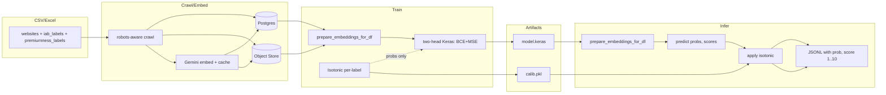

# Premiumness Scoring

## Premiumness spec
Premiumness predicts a per‑vertical, per‑geo score in the 1–10 range reflecting ad inventory quality for each IAB category, trained jointly with multilabel classification on a shared embedding trunk to leverage supervision from both tasks.
Scores are normalized to $$$$ during training and mapped back to integers at inference; classification probabilities are optionally calibrated with per‑label isotonic, while scores are discretized without separate calibration for stability.

## Why it exists
- Advertisers need category‑specific quality signals; a site can be premium for News (IAB12) and mid for Sports (IAB17) in the same market, affecting campaign eligibility and bid decisions.
- Per‑geo modeling encodes regional behavioral and safety differences and is versioned in the model registry to enable safe rollbacks and longitudinal tracking.

## Labels and inputs
- Labeled CSV: website, iab_labels, premiumness_labels as JSON map {IAB_ID: 1..10}; if only a global “Premiumness Score” is present, it is propagated to listed IABs to seed training where per‑vertical scores are missing.
- Unlabeled CSV: website only (optionally content_text); used to strengthen the classification head even when score labels are sparse, enabling mixed supervision.

## Model head and loss
- Shared trunk feeds two heads: labels head uses sigmoid with BCE; scores head uses sigmoid with MSE, with a lower loss weight (default 0.3) to prioritize separation of IAB categories.
- Keras build: Dense(512) → BN → Dropout → Dense(1024) → Dropout → heads; compiled with Adam at $$1\times10^{-3}$$, matching the production multilabel implementation.

## Target building
- Labels: multi‑hot vectors over IAB IDs after normalization to uppercase IAB codes for consistent class ordering across training and inference.
- Scores: clamp integer inputs to 1–10, convert to $$$$ via $$s'=\frac{s-1}{9}$$; missing scores remain 0.0 for that label, allowing the labels head to train while the scores head updates only where labels exist.

## Inference output
- Emit top‑k categories with fields {id, label, prob, score}; the score is $$\hat{s}=\text{round}(1+9\cdot \hat{y})$$, clipped to  for display and ranking joins.
- Classification probabilities are optionally calibrated per label using isotonic fitted on validation splits; scores are not separately calibrated to avoid overfitting and retain monotonic mapping.

## Evaluation gates
- Classification: target $$F1_{\text{macro}}$$ top‑1 ≥ 0.90 and top‑3 ≥ 0.95 with improved ECE/Brier after isotonic calibration compared to raw sigmoid.
- Premiumness: target Spearman ≥ 0.6 per vertical where label volume suffices; monitor per‑geo score distributions and drift across model versions to ensure operational stability.

## CLIs and usage
- Train: poetry run verticalizer train --geo US --in labeled.csv --version v2025_09 --out-base models/ (trains both heads; writes model.keras and calib.pkl under geo/version).
- Infer: poetry run verticalizer infer --geo US --in websites.csv --model models/US/v2025_09/model.keras --calib models/US/v2025_09/calib.pkl --out preds.jsonl --topk 5 (applies per‑label isotonic to probs).
- Eval: poetry run verticalizer eval --pred preds.jsonl --gold gold.json --out report.json; add an offline Spearman computation for scores per vertical as a notebook or extension.

## Data contracts
- Labeled CSV: website, iab_labels (JSON/CSV), premiumness_labels (JSON IAB→1..10), content_text optional, geo optional; IDs normalized to uppercase IABxx.
- Predictions JSONL: one row per site with geo and categories[{id,label,prob,score}] along with generated_at, consumable by downstream ranking systems and QA tools.

## Architecture (Premiumness flow)
This diagram mirrors the production flow and shows where calibration applies only to probabilities.

## UX guidance
- For each category, present a calibrated probability bar and an integer score chip (1–10) with a color ramp; include a geo/version pill to ensure auditing and reproducibility.
- Provide CSV export with website, iab_id, label, prob, score to facilitate joins with supply ranking and targeting systems without additional post‑processing.

## Ops and cost controls
- Embedding cache, QPS rate‑limit, max‑calls, and dry‑run enable deterministic, idempotent reruns; selection of the latest excerpt by content hash prevents unnecessary re‑embedding.
- Models persist per geo; the registry stores artifact paths and config JSON, supporting deterministic inference selection, rollout gating, and rollbacks.

## What to add to the parent spec
- Include this Premiumness section verbatim under a “Premiumness Spec” CTA so readers can discover the scoring head distinctly from classification.
- Place the Premiumness flow alongside the system diagram to clarify dual outputs and where calibration is applied in the inference stack.

## Alignment with code paths
- Two‑head Keras, loss weights, and the integer mapping round(1+9·ŷ) are implemented in the training and inference stack and match the spec.
- Per‑label isotonic is saved/loaded via calib.pkl and applied to classification probabilities at inference; the scores head is discretized to 1–10 without separate calibration.

## Optional next steps
- Add an eval extension to compute Spearman per vertical and per geo with stratification by label volume; keep classification eval unchanged for comparability.
- Add drift monitors on score distributions per geo; alert on version‑to‑version shifts to preserve advertiser trust and campaign stability.

## Grounded examples (US/IN sheets)
- US/IN Excel workbooks include many rows with a single global “Premiumness Score”; the converter retains these and allows future overrides via per‑vertical premiumness_labels.
- The ranking sheet signals category difficulty and can guide sampling or loss re‑weighting later; current implementation uses a fixed 0.3 score loss weight for simplicity and robustness.
