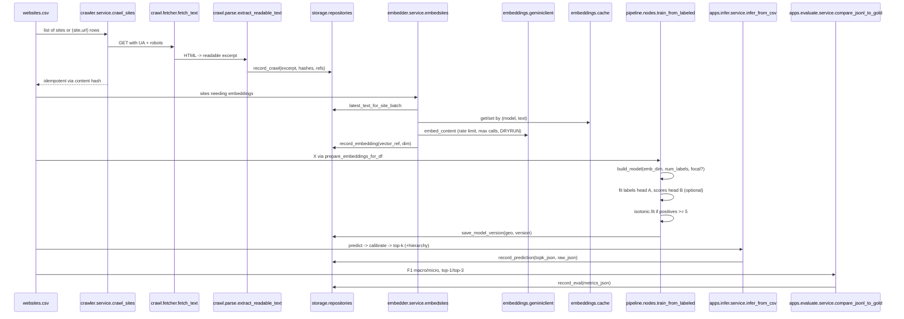
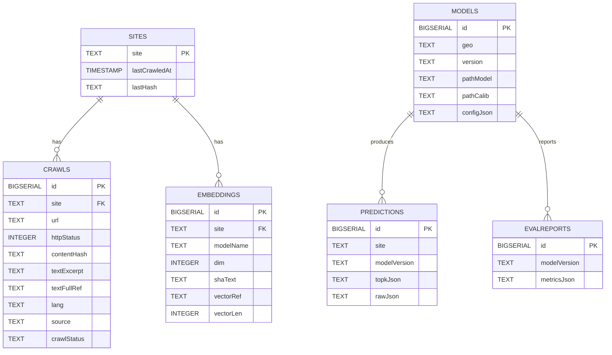

# Website Verticalizer – Deep Dive

## What it does
Website Verticalizer assigns each site to one or more IAB categories using semantic text embeddings and a calibrated multilabel classifier, emitting IAB IDs, human labels, and calibrated probabilities suitable for contextual targeting and analytics; an optional head predicts per‑vertical 1–10 “Premiumness” scores for ranking/QA. The system supports versioned IAB taxonomies (v3.0 and v2.2), hierarchy‑consistent outputs, ensembling, and site‑level aggregation over multiple URLs.

## Why this design
- Aligns with IAB standards via versioned loaders and normalization, ensuring consistent IDs across training/inference.
- Controls cost with cache‑first embeddings, rate limiting, dry‑run, and idempotent stages.
- Improves reliability with per‑label isotonic calibration, hierarchy enforcement, and multi‑page aggregation at the site level.

## High‑level architecture
Cache‑first, idempotent stages minimize duplicate work; embeddings are reused and can be persisted. Optional object storage holds HTML, vectors, and models; Postgres stores metadata and evaluation results.

```mermaid
flowchart LR
  A[websites.csv] --> B[Crawl (robots-aware readability)]
  B --> C[Embed (cache + dedup)]
  C --> D[Train (multilabel + calib)]
  D --> E[Persist (artifacts: .keras + calib.pkl)]
  E --> F[Infer top-k (calibrated JSONL)]
  F --> G[Eval (F1, top-k comparator)]

  subgraph Optional Infra
    S3[(S3/MinIO)]:::store
    PG[(Postgres)]:::db
  end

  B -- raw HTML --> S3
  C -- .npy bytes --> S3
  E -- model, calib --> S3

  B -- crawls --> PG
  C -- embeddings --> PG
  E -- model registry --> PG
  F -- predictions --> PG

  classDef store fill:#eef,stroke:#99f,color:#000;
  classDef db fill:#efe,stroke:#9f9,color:#000;
```


## Core architecture (sequence)
Services and contracts across stages: crawler, embedder, storage, training, inference, and evaluation.




## Persistence (ERD)
Relational storage captures sites, crawls, embeddings, models, predictions, and evaluation metrics; object storage holds raw HTML, vectors, and model artifacts.




## IAB taxonomy and hierarchy
- Versioned loaders: v3.0 and v2.2 supported with id_to_label, label_to_id, and parent→children graph for hierarchy‑aware processing.
- Explicit version propagation: pass --iab-version in train/infer; optional mapping utilities allow cross‑version normalization where needed.
- Hierarchy constraints: enforce_hierarchy applies small parent probability floors for predicted children; add_parents_to_topk augments outputs for readability when children appear without parents.

Integration notes
- Place taxonomy JSONs under data/taxonomy/{v3,v2_2}/: id_to_label.json, label_to_id.json, graph.json; optional mapping under data/taxonomy/map/.

## Data contracts
- Labeled training CSV
  - website: domain (cnn.com).
  - iablabels: JSON array of uppercase IAB IDs (["IAB12","IAB1"]); comma‑separated accepted.
  - Optional: contenttext; if absent, training will crawl the latest excerpt.
  - Optional: premiumnesslabels JSON map IAB→1..10 for ranking head.
- Inference CSV (single URL per site)
  - website: domain; optional contenttext.
- Inference CSV (multi‑URL per site)
  - website, url: multiple rows per site; page probabilities aggregated to site level before top‑k.
- Predictions JSONL
  - { website, categories: [{ id, label, prob }] } per line; top‑k configurable; hierarchy parents may be appended.

## Embeddings
- Primary: Gemini embeddings with cache‑first semantics, dedup by normalized text, QPS rate limiting, MAXCALLS, and DRYRUN for cost control; empty text yields zero vectors while preserving order.
- Optional: Sentence‑Transformers (open‑source) as an offline/ensemble encoder; enabled via environment and used side‑by‑side with the primary encoder.
- Optional: OpenAI embeddings can be added for maximum quality; wire a small provider class mirroring the Gemini client interface (embed_text, embed_texts_dedup), read API keys from env, and register it behind a feature flag to switch providers or ensemble across providers. This preserves contracts and allows choosing the most accurate vectors when budget and policy permit.

Provider guidance
- Choose one primary encoder for cost and consistency; enable a second encoder to ensemble for higher macro‑F1 or robustness; cache aggressively to minimize API churn.

## Model
- Trunk: MLP over embeddings (Dense→BN→Dropout→Dense→Dropout, ReLU).
- Heads:
  - Labels head: multilabel with sigmoid outputs; losses: BCE or focal loss; metrics: AUC/Precision/Recall; per‑label isotonic calibration post‑hoc.
  - Scores head (optional): sigmoid + MSE for 1–10 Premiumness; lower loss weight to prioritize category separation.
- Training practices: early stopping (val AUC), focal loss for imbalance, per‑site stratification during data prep, and per‑label isotonic when positives ≥ 5.

## Inference
- Single or multiple models: supports ensembling and averaging calibrated probabilities (mean or softmax_mean).
- Multi‑URL aggregation: group by website, aggregate across pages (mean/softmax_mean), then choose top‑k; apply hierarchy consistency and parent augmentation to outputs.
- Output: JSONL with id/label/prob; k configurable.

## Evaluation
- Metrics: F1 macro/micro, top‑1 and top‑3; macro‑F1 emphasizes tail categories; top‑k reflects ranking utility; track ECE/Brier for calibration.
- Drift: re‑embed and re‑evaluate periodically; recalibrate isotonic faster than full retrain; monitor cache hit‑rate and label frequencies.

## How this satisfies requirements
- IAB alignment and labels: Versioned loaders, normalization by ID/label, explicit version propagation, parent/children graph.
- Hierarchy constraints: enforce_hierarchy floors and add_parents_to_topk to maintain consistency and readability.
- Training data strategy: Kaggle ingester produces clean labeled CSV; room for crawl‑based weak labels and balancing.
- Model/pipeline best practices: focal loss, early stopping, per‑label isotonic, macro/micro F1 and top‑k, optional second encoder and ensembling.
- Additional gaps closed: explicit versioning, hierarchy consistency, ensembling, site‑level multi‑URL aggregation, and CLI/Make targets to control behaviors.

## CLIs and “how to run”
Use the Makefile targets to avoid duplicated command snippets; see README.md → “How to run” for canonical steps and variables (GEO, VERSION, IAB_VERSION, paths). Typical sequence: make run-ingest → make run-train → make run-crawl → make run-infer (or run-infer-ensemble) → outputs in out/preds.jsonl.

## Pros and cons

Architecture
- Pros
  - Decoupled, idempotent stages with cache‑first reuse and clear persistence contracts; horizontally scalable per stage.
  - Optional S3/MinIO and Postgres improve auditability and reproducibility.
- Cons
  - Batch‑oriented; requires job orchestration and storage; not a low‑latency online API.

Embeddings and LLM usage
- Pros
  - Strong semantic signal with reusable vectors; DRYRUN/MAXCALLS limit cost; sentence‑transformers provides offline option; OpenAI can maximize accuracy when enabled.
- Cons
  - Provider drift and policy constraints; cache invalidation and distribution shifts require monitoring; zero‑vectors in DRYRUN reduce realism for tests.

Classifier and calibration
- Pros
  - Robust multilabel head; focal loss for imbalance; isotonic yields calibrated probabilities; hierarchy rules enforce consistency.
- Cons
  - Fixed embeddings limit end‑to‑end adaptation; isotonic needs sufficient positives; hierarchy floors are heuristic constraints.

Aggregation and ensembling
- Pros
  - Multi‑URL aggregation stabilizes site decisions; ensembles often raise macro‑F1 and top‑k with simple averaging.
- Cons
  - Higher inference cost across pages/models; careful weighting and calibration alignment needed.

Operational
- Pros
  - Good observability (cache hit‑rate, QPS, durations); deterministic versioned artifact paths.
- Cons
  - Requires taxonomy upkeep and periodic recalibration; crawler subject to robots/anti‑bot controls.

## Appendix: machine learning glossary (detailed)

- Multilabel classification
  - Instances may belong to multiple labels simultaneously; sigmoid per label instead of softmax across labels.
- Embeddings
  - Dense semantic vectors of text; here, precomputed embeddings feed a shallow classifier for efficiency.
- Deduplication (embedding)
  - Normalize text and reuse cached vectors for identical strings to reduce cost and API calls.
- Calibration (isotonic regression)
  - Monotonic mapping of raw probabilities to calibrated probabilities; fit per label with sufficient positives (≥5).
- Expected Calibration Error (ECE)
  - Measures confidence vs accuracy mismatch across bins; lower is better.
- Macro‑F1 vs Micro‑F1
  - Macro treats each label equally; micro aggregates across instances/labels, favoring frequent labels.
- Top‑k accuracy
  - True if any gold label appears in top‑k predicted labels for an instance.
- Focal loss
  - Reweights loss toward hard examples via gamma; helpful for class imbalance.
- Early stopping
  - Stops training when validation metric stalls; reduces overfitting and runtime.
- Hierarchy consistency
  - Enforces minimal support for ancestors when a child is predicted; aligns with taxonomy structure.
- Ensembling
  - Combine predictions from multiple models/encoders to improve generalization/calibration.
- Softmax‑mean aggregation
  - Apply softmax across labels per row then average across rows to emphasize peaked distributions.
- Site‑level aggregation
  - Combine page‑level predictions to a single site decision via mean/softmax_mean.
- DRYRUN and MAXCALLS
  - Simulate or cap embedding calls; keep array shapes/order stable for reproducibility.
- Stratified split by site
  - Avoid leakage by keeping pages from the same domain in the same fold.
- IAB taxonomy versions and mapping
  - Versioned taxonomies (v2.2, v3.0); optional mapping tables for cross‑version compatibility.
- Parent augmentation in top‑k
  - Append ancestor categories for readability when only children rank in top‑k.
- Label imbalance
  - Skewed label frequencies; mitigate with focal loss, sampling, or weak labeling.
- Brier score
  - Mean squared error of probabilistic predictions; complements ECE for calibration assessment.

## Operational guidance

- Taxonomy assets: place id_to_label.json, label_to_id.json, graph.json under data/taxonomy/{v3,v2_2}; add map/ for cross‑version files if needed.
- Training data: prefer Kaggle ingester or curated corpora; consider adding crawl‑based weak labels later; keep label normalization to IAB IDs.
- Run steps: use Makefile targets (run‑ingest, run‑train, run‑crawl, run‑infer, run‑infer‑ensemble, run‑all) to ensure consistent parameters without duplicated shell blocks. See README.md.

