# Website Verticalizer - Deep Dive

## What it does
The Website Verticalizer assigns each site to one or more IAB Tier‑1 categories using LLM semantic embeddings and a multilabel classifier, with optional per‑label probability calibration for ranking and thresholds; it also shares its embedding trunk with a per‑vertical 1–10 “Premiumness” head when enabled.
Pipelines are modular CLIs (crawl, embed, train, infer, eval), file‑driven, and optionally persist to Postgres and S3/MinIO with per‑geo model versioning for reproducible inference and rollbacks.

## High‑level architecture
The flow emphasizes cache‑first, idempotent stages and optional infra for blob and metadata persistence.
Insert this Mermaid diagram as the hero visualization on the page.
```mermaid
flowchart LR
  A[websites.csv] --> B[🕸️ Crawl\nrobots-aware + readability]
  B --> C[🔷 Embed\nGemini + cache/dedup]
  C --> D[🧠 Train\nKeras multilabel + calib]
  D --> E[✍️ Persist artifacts\nmodel.keras + calib.pkl]
  E --> F[✨ Infer\ntop-k JSONL (calibrated)]
  F --> G[📏 Eval\nmacro-F1, top-k comparator]

  subgraph Optional Infra
    S3[(S3/MinIO\nraw HTML, vectors, models)]
    PG[(Postgres\nsites, crawls, embeddings,\nmodels, predictions, evalreports)]
  end

  B -- raw HTML --> S3
  C -- .npy bytes --> S3
  E -- model, calib --> S3

  B -- crawls --> PG
  C -- embeddings --> PG
  E -- model registry --> PG
  F -- predictions --> PG
```

## Control path sequence
This sequence diagram captures service boundaries and contracts among crawler, embedder, storage, model training, inference, and evaluation.

```mermaid
sequenceDiagram
  participant CSV as websites.csv
  participant Crawl as crawler.service.crawl_sites
  participant Fetch as crawl.fetcher.fetch_text
  participant Parse as crawl.parse.extract_readable_text
  participant Repo as storage.repositories
  participant Emb as embedder.service.embed_sites
  participant Gem as embeddings.gemini_client
  participant Cache as embeddings.cache
  participant Train as pipeline.nodes.train_from_labeled
  participant Infer as pipeline.nodes.infer
  participant Eval as pipeline.nodes.evaluate

  CSV->>Crawl: list of sites
  Crawl->>Fetch: GET with UA + robots
  Fetch->>Parse: HTML → readable excerpt
  Parse->>Repo: record_crawl(excerpt, hashes, refs)
  Crawl-->>CSV: idempotent (content_hash)

  CSV->>Emb: sites needing embeddings
  Emb->>Repo: latest_text_for_site_batch
  Emb->>Cache: get/set by (model, text)
  Emb->>Gem: embed_content (rate limit, max calls)
  Emb->>Repo: record_embedding(vector_ref, dim)

  CSV->>Train: X from prepare_embeddings_for_df
  Train->>Train: build_model(emb_dim, num_labels)
  Train->>Train: fit(labels head A, scores head B)
  Train->>Train: isotonic.fit if positives>=5
  Train->>Repo: save_model_version(geo, version)

  CSV->>Infer: predict → calibrate → top‑k
  Infer->>Repo: record_prediction(topk_json, raw_json)

  CSV->>Eval: multilabel metrics, top‑k
  Eval->>Repo: record_eval(metrics_json)
```


## Storage ERD
This ERD documents Postgres tables and how blobs are placed in object storage; it is the source of truth for persistence contracts.


## Data contracts
Inputs accept either IAB IDs or labels; these are normalized to uppercase IAB IDs via taxonomy maps bundled in the repo to ensure consistent class indexing.
Labeled CSV requires “website”; iablabels may be JSON array or comma‑separated IDs, contenttext and geo are optional; predictions are JSONL with categories {id,label,prob} and generatedAt; optional DB persistence stores both topk_json and raw_json.

## Crawling and parsing
The crawler is robots.txt‑aware, uses a courtesy delay (0.7s), and configurable User‑Agent/timeout; errors are captured with status and fallback paths logged for analysis.
Readable extraction removes scripts/styles, uses Readability + BeautifulSoup to assemble a normalized excerpt used as the embedding source of truth.

## Embeddings and LLM choice
Embeddings are produced via a Gemini client with cache‑first semantics, deduplication by normalized text, QPS rate limiting, MAXCALLS caps, and DRYRUN to bound costs or simulate runs.
The embedding dimension and model name are env‑controlled; empty text or cost guardrails yield zero vectors to keep pipelines idempotent while preserving ordering and sample counts.

## Classification model
A shared trunk uses Dense(512)→BN→Dropout→Dense(1024)→Dropout with ReLU, input size = embedding dimension; Head A is the multilabel classifier trained with sigmoid + BCE and tracked with AUC/Precision/Recall.
Head B is a scores head for 1–10 “Premiumness” (MSE) weighted lower to prioritize category separation; for pure verticalization, Head A is the operative output and calibration applies only to probabilities.

## Probability calibration
Per‑label isotonic regression is fitted only when sufficient positives exist (≥5 across the dataset), serializing to calib.pkl next to model.keras and applied at inference to transform raw sigmoid outputs.
If a calibrator is not available for a label, the transform no‑ops for that label to maintain monotonicity and preserve top‑K ordering where appropriate.

## Training workflow
Given a geo‑scoped labeled CSV, steps include prepare_embeddings_for_df reuse, model build, fitting both heads, conditional isotonic fit, and artifact saving + registry row keyed by (geo, version).
Targets and acceptance thresholds (macro‑F1, top‑K) are reported by evaluation; Excel‑to‑CSV helper supports fixed‑format workbooks for rapid dataset onboarding.

## Inference workflow
Inference ensures latest text, reuses embeddings cache, runs model.predict, applies calibrator if present, sorts per‑site, and emits top‑K categories with calibrated probabilities to JSONL and/or Postgres.
Top‑K is configurable via CLI flags to match downstream ranking needs while keeping the output contract stable.

## Evaluation and accuracy
Ground truth is built from labeled CSV; metrics include $$F1_{\text{macro}}$$, $$F1_{\text{micro}}$$, sample accuracy, and top‑K accuracy at $$k \in \{1,3\}$$ to monitor ranking quality.
Acceptance targets aim for calibrated macro‑F1 top‑1 ≈ 0.90 and top‑3 ≈ 0.95 in mature data regimes, with ECE/Brier improvements from isotonic calibration vs uncalibrated baselines.

## Cost‑effectiveness and batch semantics
Cost controls include: cache‑first embedding on normalized text, deduplication across identical strings, QPS rate limiter, MAXCALLS cap, DRYRUN mode, and idempotent re‑runs based on content hashes.
Batch flows are supported end‑to‑end by CLIs; embeddings client exposes “embed_texts_dedup” and the pipeline helper “prepare_embeddings_for_df” orchestrates reuse to minimize API calls and object‑store churn.

## Batch “API” usage mode
For cost‑optimized operation, the repo provides batch CLIs that serve API‑like workloads through CSV/JSONL interfaces; “run‑pipeline” composes convert→train→infer→compare in one shot.
For programmatic integration, the infer service accepts model/calib paths and writes JSONL, which can be polled or ingested by downstream systems; Postgres tables expose predictions and artifacts for internal RPCs.

## Scalability and performance
Pipelines are stage‑decoupled and idempotent, enabling horizontal scaling per stage (e.g., parallel crawl or embed batches) and safe retries; DB writes are thin and transactional with rollback handling.
Embedding client supports retries for transient 429/503, simple rate limiting, and persistent caching to increase cache hit rate on repeated corpora or retrains.

## Stability and reliability
Failure modes are explicitly handled: robots denials or fetch failures still record crawl rows, and DRYRUN/MAXCALLS produce zero vectors that keep the sample matrix shape stable for training/inference.
Observability includes cache hit‑rate logs, QPS limiting stats, API call counters, and stage durations; DB writes are wrapped with exception handling to avoid partial state.

## Persistence contracts
DDL is auto‑created for sites, crawls, embeddings, models, predictions, and evalreports; object storage uses deterministic paths for raw HTML, embedding bytes, and model/calibrator artifacts.
The model registry records geo, version, paths, and config JSON, enabling deterministic artifact selection at inference and transparent rollbacks or A/B deployments.

## CLIs and quickstart
Example commands: crawl, embed, train, infer, eval, and the composed run‑pipeline; these map exactly to the contracts described above for reproducible batch runs and CI integration.
Train and infer accept explicit model/calib paths and top‑K control; eval compares JSONL predictions to a gold JSON map and emits a QA report with overlap details.

## Premiumness head (optional)
When enabled, the shared trunk feeds a second head producing per‑vertical 1–10 scores; probabilities are calibrated via isotonic, while scores are discretized without separate calibration.
Place the dedicated Premiumness flow alongside this page’s diagrams to clarify dual outputs (calibrated prob + integer score) and geoversioning semantics for advertisers’ ranking use cases.

## Page placement and UX
Use the high‑level flow as the top hero; place the sequence diagram in “Core Architecture” and the ERD under “Persistence”; add geoversion, cache‑hit badges, and stage status pills to guided runs.
Primary CTAs should link to Run Train, Run Infer, Open Predictions, and Compare vs Gold with sample CSV/JSONL and a minimal .env to reduce setup friction.
